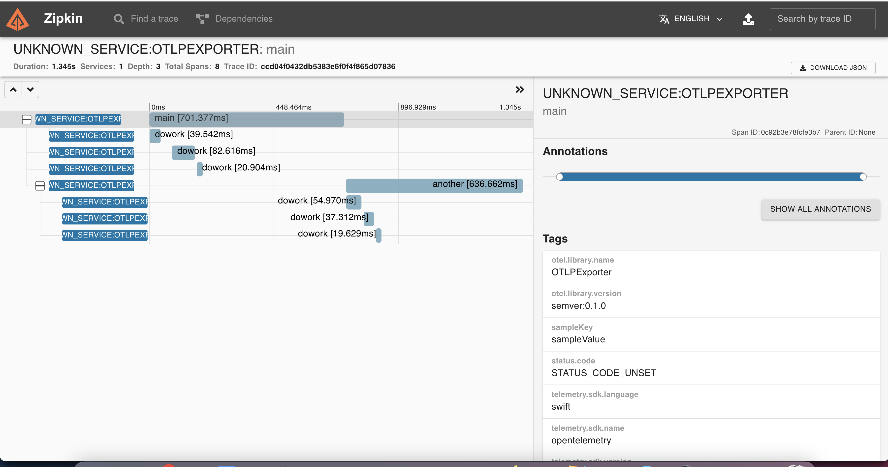
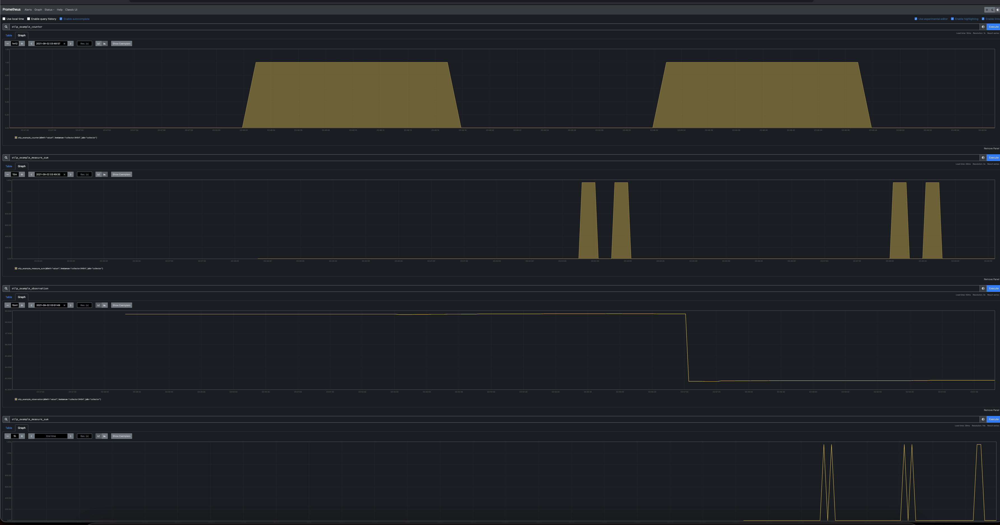

### Opentelemetry collector, Prometheus and Zipkin running locally as a docker images


## Run the Application

1. Run docker: This will start otel-collector, Zipkin and Prometheus

    ```shell script
    # from this directory
    docker-compose up
    ```

2. Run  app

    ```shell script
    # from the app directory
    go run .
    ```

3. Teardown the docker images

    ```shell script
    # from this directory
    docker-compose down
    ```

4. Open page at <http://localhost:9411/zipkin/> -  you should be able to see the spans in zipkin


### Prometheus UI

The prometheus client will be available at <http://localhost:9090>.

Note: It may take some time for the application metrics to appear on the Prometheus dashboard.


5. If you don't set service.name as per https://github.com/open-telemetry/opentelemetry-specification/blob/main/specification/sdk-environment-variables.md the default name of the service and spans generate by the OTLP Exporter is `unknown_service:otlpexporter` You can either set the service.name in the code or set the environment variable for OTEL_RESOURCE_ATTRIBUTES, or set it via command line:

    ```shell script
    # from this directory
    OTEL_RESOURCE_ATTRIBUTES="service.name=shipping-service,service.version=v1.2.3" go run .
    ```
This will create a service and spans with the name `shipping-service`

## Useful links

- For more information on OpenTelemetry, visit: <https://opentelemetry.io/>
- For more information on OpenTelemetry Golang, visit: <https://opentelemetry.io/docs/instrumentation/go/getting-started/>
- For more information on trace, visit: <https://github.com/open-telemetry/opentelemetry-go/tree/main/trace>
- For more information on metrics, visit: <https://github.com/open-telemetry/opentelemetry-go/tree/main/metric>

## LICENSE

Apache License 2.0
